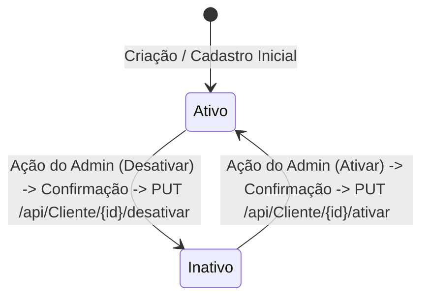

# Data Model: Gestão de Clientes na Área Administrativa

**Feature Branch**: `001-admin-customer-management`  
**Date**: 2026-09-04  
**Feature Spec**: [spec.md](./spec.md)  
**Research**: [research.md](./research.md)

---

## 1. Contratos de Rede Globais (Core Models)

### 1.1 Envelope Padronizado de Resposta (`ApiResponse<T>`)
Localização física: `src/app/core/models/api-response.model.ts`  
Representa a casca padrão retornada por todos os endpoints da API backend conforme `contrato.md` e `swagger.json`.

```typescript
export interface ApiResponse<T> {
  message: string;
  dados: T;
}
```

### 1.2 Detalhes de Erro de Especificação RFC 7807 (`ProblemDetails`)
Localização física: `src/app/core/models/problem-details.model.ts`  
Estrutura enviada pelo ASP.NET Core em erros de requisição HTTP (ex.: 400 Bad Request, 404 Not Found).

```typescript
export interface ProblemDetails {
  type?: string;
  title?: string;
  status?: number;
  detail?: string;
  instance?: string;
  [key: string]: unknown;
}
```

### 1.3 Notificação Flutuante (`ToastNotification`)
Localização física: `src/app/core/models/toast-notification.model.ts` (ou exportada em `src/app/shared/ui/toast-host/toast-host.component.ts`)

```typescript
export interface ToastNotification {
  id: string;
  type: 'success' | 'error' | 'warning' | 'info';
  title: string;
  message?: string;
  duration?: number; // Tempo em ms, padrão 5000
}
```

---

## 2. Entidades de Domínio do Cliente (Customer Feature Models)

Localização física: `src/app/features/admin/customers/models/customer.model.ts`

### 2.1 Enumeração de Gênero (`Genero`)
Espelha o schema `Genero` de `docs/api/swagger.json`.

```typescript
export enum Genero {
  Masculino = 0,
  Feminino = 1,
  Outro = 2
}

export const GeneroLabels: Record<Genero, string> = {
  [Genero.Masculino]: 'Masculino',
  [Genero.Feminino]: 'Feminino',
  [Genero.Outro]: 'Outro'
};
```

### 2.2 DTO de Endereço (`EnderecoResponseDto`)
Espelha o schema `EnderecoResponseDto` de `docs/api/swagger.json`.

```typescript
export interface EnderecoResponseDto {
  idEndereco: number;
  logradouro: string;
  numero: number;
  bairro: string;
  complemento?: string | null;
  cep: string;
  municipio: string;
  uf: string;
  isEntrega: boolean;
  isCobranca: boolean;
}
```

### 2.3 DTO de Resposta de Cliente (`ClienteResponseDto`)
Espelha o schema `ClienteResponseDto` de `docs/api/swagger.json`.

```typescript
export interface ClienteResponseDto {
  idCliente: string; // Formato UUID
  nome: string;
  cpf: string;
  dataNascimento: string; // Formato ISO 8601 (date-time)
  ativo: boolean;
  email: string;
  genero: Genero;
  ddd: string;
  telefone: string;
  isAdmin: boolean;
  enderecos?: EnderecoResponseDto[];
}
```

---

## 3. Modelos de Estado de UI e Filtros

Localização física: `src/app/features/admin/customers/models/customer-filter.model.ts`

```typescript
export type CustomerStatusFilter = 'all' | 'active' | 'inactive';

export interface CustomerFilterState {
  searchTerm: string;
  status: CustomerStatusFilter;
}
```

---

## 4. Máquina de Estados e Transições de Status

O ciclo de vida do status cadastral do cliente no sistema opera em dois estados binários controlados pelo administrador:



### Regras de Transição:
1. **Ativar Cliente**:
   - Pré-condição: Cliente com `ativo === false`.
   - Ação do Usuário: Clique em "Ativar" na tabela ou modal de detalhes.
   - Confirmação: Modal de diálogo solicitando confirmação.
   - Disparo: Chamada HTTP `PUT /api/Cliente/{idCliente}/ativar`.
   - Pós-condição: `ativo === true`, exibição de toast de sucesso e atualização da listagem.
2. **Desativar Cliente**:
   - Pré-condição: Cliente com `ativo === true`.
   - Ação do Usuário: Clique em "Desativar" na tabela ou modal de detalhes.
   - Confirmação: Modal de diálogo alertando sobre a suspensão de acesso.
   - Disparo: Chamada HTTP `PUT /api/Cliente/{idCliente}/desativar`.
   - Pós-condição: `ativo === false`, exibição de toast de sucesso e atualização da listagem.
