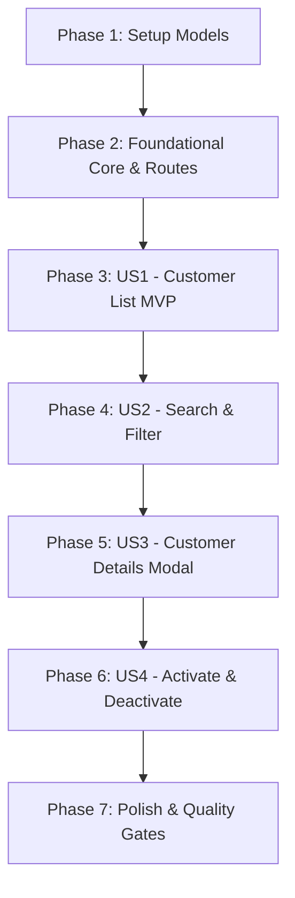

# Tasks: Gestão de Clientes na Área Administrativa

**Feature Branch**: `001-admin-customer-management`  
**Date**: 2026-09-04  
**Spec**: [spec.md](./spec.md) | **Plan**: [plan.md](./plan.md)

---

## Phase 1: Setup (Shared Infrastructure)

**Purpose**: Criação dos modelos centrais, contratos de rede e estruturas de dados compartilhadas.

- [X] T001 Create ApiResponse and ProblemDetails models in src/app/core/models/api-response.model.ts and src/app/core/models/problem-details.model.ts
- [X] T002 [P] Create customer domain models and Genero enum in src/app/features/admin/customers/models/customer.model.ts
- [X] T003 [P] Create CustomerFilterState model in src/app/features/admin/customers/models/customer-filter.model.ts

---

## Phase 2: Foundational (Blocking Prerequisites)

**Purpose**: Infraestrutura global (serviço de toast, interceptor HTTP de erro e desacoplamento de rotas) obrigatória antes da implementação das histórias de usuário.

- [X] T004 Implement NotificationService with Angular Signals in src/app/core/services/notification.service.ts
- [X] T005 [P] Update ToastHostComponent in src/app/shared/ui/toast-host/toast-host.component.ts to consume NotificationService
- [X] T006 [P] Implement errorInterceptor in src/app/core/interceptors/error.interceptor.ts to capture HTTP errors and dispatch toasts
- [X] T007 Register errorInterceptor in src/app/app.config.ts via provideHttpClient withInterceptors
- [X] T008 Create barrel export file in src/app/core/index.ts for core models, services, and interceptors
- [X] T009 [P] Modularize admin routing by creating src/app/features/admin/admin.routes.ts
- [X] T010 [P] Modularize client routing by creating src/app/features/client/client.routes.ts
- [X] T011 Update root routes in src/app/app.routes.ts to delegate to admin.routes.ts and client.routes.ts
- [X] T012 Implement CustomerService base and getCustomers method in src/app/features/admin/customers/services/customer.service.ts

**Checkpoint**: Camada core, serviços globais, rotas e serviço de clientes base configurados. O desenvolvimento das histórias de usuário pode prosseguir.

---

## Phase 3: User Story 1 - Visualização e Listagem de Clientes (Priority: P1) 🎯 MVP

**Goal**: Permitir ao administrador visualizar a listagem organizada de clientes em tabela com informações básicas, status e feedback de erro/carregamento.

**Independent Test**: Navegar para `/admin/customers` e verificar a renderização da tabela de clientes com Nome, CPF, E-mail, Telefone e Badge de Status (Ativo/Inativo).

### Tests for User Story 1

- [X] T013 [P] [US1] Create unit tests for CustomerService.getCustomers in src/app/features/admin/customers/services/customer.service.spec.ts

### Implementation for User Story 1

- [X] T014 [US1] Implement customer table layout, columns, and loading/empty states in src/app/features/admin/customers/pages/customer-list-page/customer-list-page.component.html
- [X] T015 [US1] Implement styling with Tailwind CSS and SCSS tokens in src/app/features/admin/customers/pages/customer-list-page/customer-list-page.component.scss
- [X] T016 [US1] Implement component state, Signals, and data fetching in src/app/features/admin/customers/pages/customer-list-page/customer-list-page.component.ts
- [X] T017 [US1] Create component rendering and empty state tests in src/app/features/admin/customers/pages/customer-list-page/customer-list-page.component.spec.ts

**Checkpoint**: User Story 1 (MVP) completamente funcional e testável de forma independente.

---

## Phase 4: User Story 2 - Pesquisa e Filtro de Clientes (Priority: P2)

**Goal**: Permitir ao administrador buscar clientes por termo-chave e filtrar a tabela instantaneamente por status (ativo/inativo).

**Independent Test**: Digitar termo na barra de pesquisa, verificar busca com debounce e alternar filtros de status confirmando a atualização reativa da lista.

### Tests for User Story 2

- [X] T018 [P] [US2] Add unit test for CustomerService.searchCustomers in src/app/features/admin/customers/services/customer.service.spec.ts

### Implementation for User Story 2

- [X] T019 [US2] Add searchCustomers method to CustomerService in src/app/features/admin/customers/services/customer.service.ts
- [X] T020 [US2] Add search input, status filter controls, and clear button in src/app/features/admin/customers/pages/customer-list-page/customer-list-page.component.html
- [X] T021 [US2] Implement debounced search signal and computed filtered customers in src/app/features/admin/customers/pages/customer-list-page/customer-list-page.component.ts
- [X] T022 [US2] Add styles for search bar, filter pills, and active states in src/app/features/admin/customers/pages/customer-list-page/customer-list-page.component.scss

**Checkpoint**: Histórias de Usuário 1 e 2 integradas e testáveis independentemente.

---

## Phase 5: User Story 3 - Visualização de Detalhes do Cliente (Priority: P3)

**Goal**: Permitir ao administrador abrir uma janela modal com a ficha completa do cliente (dados pessoais, telefones e lista de endereços com finalidades).

**Independent Test**: Clicar na ação "Detalhes" de um cliente da tabela e validar a abertura do modal com os dados cadastrais completos e endereços formatados.

### Tests for User Story 3

- [X] T023 [P] [US3] Add unit test for CustomerService.getCustomerById in src/app/features/admin/customers/services/customer.service.spec.ts

### Implementation for User Story 3

- [X] T024 [US3] Add getCustomerById method to CustomerService in src/app/features/admin/customers/services/customer.service.ts
- [X] T025 [P] [US3] Create CustomerDetailModalComponent wrapping ModalComponent in src/app/features/admin/customers/components/customer-detail-modal/customer-detail-modal.component.ts
- [X] T026 [US3] Implement template for personal details, badges, and address cards in src/app/features/admin/customers/components/customer-detail-modal/customer-detail-modal.component.html
- [X] T027 [US3] Implement styling for customer detail cards and badges in src/app/features/admin/customers/components/customer-detail-modal/customer-detail-modal.component.scss
- [X] T028 [US3] Integrate detail modal opening and selection handling in src/app/features/admin/customers/pages/customer-list-page/customer-list-page.component.html and src/app/features/admin/customers/pages/customer-list-page/customer-list-page.component.ts

**Checkpoint**: Histórias 1, 2 e 3 funcionando e testadas.

---

## Phase 6: User Story 4 - Ativação e Desativação de Cliente (Priority: P4)

**Goal**: Permitir ao administrador alternar o status cadastral de um cliente com confirmação prévia e feedback de sucesso ou erro no toast.

**Independent Test**: Clicar em "Desativar" ou "Ativar", confirmar no diálogo modal, verificar a alteração imediata na tabela e a exibição do toast de notificação.

### Tests for User Story 4

- [X] T029 [P] [US4] Add unit tests for activateCustomer and deactivateCustomer in src/app/features/admin/customers/services/customer.service.spec.ts

### Implementation for User Story 4

- [X] T030 [US4] Add activateCustomer and deactivateCustomer methods in src/app/features/admin/customers/services/customer.service.ts
- [X] T031 [P] [US4] Create CustomerStatusModalComponent wrapping ModalComponent in src/app/features/admin/customers/components/customer-status-modal/customer-status-modal.component.ts
- [X] T032 [US4] Implement template with warning message and confirm/cancel actions in src/app/features/admin/customers/components/customer-status-modal/customer-status-modal.component.html
- [X] T033 [US4] Implement styling for status confirmation dialog in src/app/features/admin/customers/components/customer-status-modal/customer-status-modal.component.scss
- [X] T034 [US4] Connect status toggle, confirmation modal, reactive status update, and toast dispatch in src/app/features/admin/customers/pages/customer-list-page/customer-list-page.component.ts and src/app/features/admin/customers/pages/customer-list-page/customer-list-page.component.html

**Checkpoint**: Todas as quatro histórias de usuário implementadas, integradas e verificadas.

---

## Phase 7: Polish & Cross-Cutting Concerns

**Purpose**: Verificação de qualidade, testes de regressão, compilação de produção e validação final.

- [X] T035 [P] Run all unit and service tests with Vitest via npm test
- [X] T036 Run production build check via npm run build to guarantee zero compilation errors
- [X] T037 [P] Validate code formatting with Prettier across modified files via npx prettier --check "src/**/*.{ts,html,scss}"
- [X] T038 Execute end-to-end verification walkthrough per specs/001-admin-customer-management/quickstart.md

---

## Dependencies & Execution Order

### Phase Dependencies

### User Story Dependencies

- **User Story 1 (P1)**: Depende apenas da Fase 2 (Foundational). Pode ser executada imediatamente para entregar o MVP.
- **User Story 2 (P2)**: Depende de US1 (tabela de clientes existente onde filtros e busca operam).
- **User Story 3 (P3)**: Depende de US1 (ações por linha de cliente na tabela existente).
- **User Story 4 (P4)**: Depende de US1 (ações por linha de cliente na tabela e `NotificationService`).

### Parallel Opportunities

- **Phase 1**: T002 e T003 podem ser criados em paralelo com T001.
- **Phase 2**:
  - T005 (`ToastHostComponent`) e T006 (`errorInterceptor`) podem ser desenvolvidos em paralelo após T004.
  - T009 (`admin.routes.ts`) e T010 (`client.routes.ts`) podem ser criados em paralelo.
- **Phase 3**: T013 (testes de serviço) pode rodar em paralelo com o desenvolvimento do layout T014/T015.
- **Phase 4**: T018 (teste de busca) pode rodar em paralelo com T020 (template de filtros).
- **Phase 5**: T023 (teste) e T025 (`CustomerDetailModalComponent`) podem ser criados em paralelo.
- **Phase 6**: T029 (teste) e T031 (`CustomerStatusModalComponent`) podem ser criados em paralelo.
- **Phase 7**: T035 e T037 podem ser executados em paralelo.

---

## Implementation Strategy

### MVP First (User Story 1 Only)

1. Executar Phase 1 (Setup Models) e Phase 2 (Foundational Core & Routes).
2. Implementar Phase 3 (User Story 1: Tabela de Clientes).
3. **Validar MVP**: Executar `npm test` e abrir `/admin/customers` para validar a listagem funcional.

### Entrega Incremental

1. **Incremento 1**: Listagem funcional de clientes (MVP).
2. **Incremento 2**: Adição de barra de pesquisa com debounce e filtros de status ativos/inativos.
3. **Incremento 3**: Modal com ficha cadastral e visualização de endereços de entrega/cobrança.
4. **Incremento 4**: Diálogo modal de segurança para ativação/desativação e feedback de toast.
5. **Incremento 5**: Build limpo, formatação e validação ponta a ponta do quickstart.
